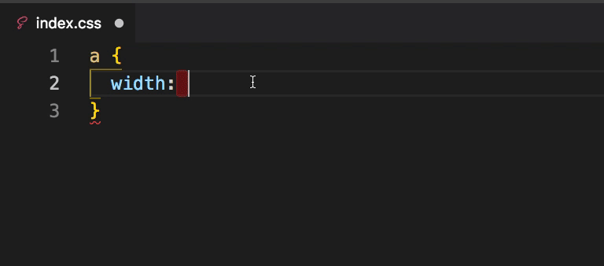
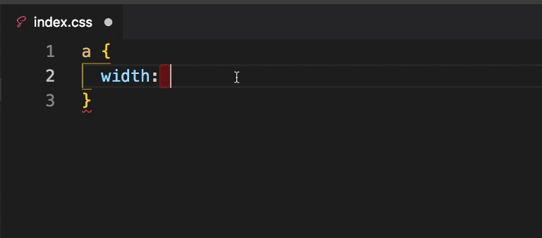

 

## px2remvw

把 px 转成 rem 或 vw，并且能显示 rem、vw 对应的 px 值





## 安装

1. 通过命令行安装

   ```shell
   ext install px2remvw
   ```

2. 直接在 vscode 编辑上插件上查找安装 `px2remvw`

3. [下载 vsix](https://marketplace.visualstudio.com/items?itemName=qianlifeng.px2remvw)

   > 打开 vscode，拓展，点击三个小点，“从 VSIX 安装”，即可。成功后重启软件。

## 配置

默认设计稿宽度为：750

- `config.fixedDigits` 保留几位小数
- `config.baseWidth` 设计稿宽度, 默认 1920px
- `config.baseHidth` 设计稿高度, 默认 1080px
- `config.cursor` 指针样式
- `config.remUnit` 1rem 转 px 大小, 默认 16px
